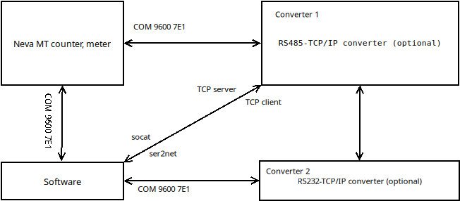

# Исходные коды (origin code)
Origin code is [here](https://github.com/vika-sonne/NevaMt3xx), [here](https://github.com/dmnovikov/neva-py3) and [here](https://github.com/AlexObukhoff/neva-py3).<br> 
Оригинальные исходные коды находятся [здесь](https://github.com/vika-sonne/NevaMt3xx), [здесь](https://github.com/dmnovikov/neva-py3) и [здесь](https://github.com/AlexObukhoff/neva-py3).<br> 
Оригинальные исходные коды написаны для Python 2.x.<br><br>
Также существует [библиотека](https://github.com/nnemirovsky/pyneva) для подключения к счетчикам, не связанная с указанными выше исходными кодами.

# Библиотека для связи со счетчиками электроэнергии Нева МТ3хх
Работа с приборами учёта происходит согласно МЭК 61107 и [OBIS](http://www.dlms.com/documentation/listofstandardobiscodesandmaintenanceproces/index.html) кодам (кроме байта контрольной суммы пакета, он не соответствует МЭК 61107 (ISO 1155)). Работа согласно протоколу МЕК 61107 реализована отдельной библиотекой, которая может быть использована для работы с другими типами приборов.<br>
**Библиотека тестировалась на Ubuntu x64 23.10 и Python 3.11.**<br>
Список OBIS кодов и описание протокола находится в папке [documents](/documents).
## Основные изменения
1. Устранены все ошибки при компиляции
2. Добавлена возможность подключения счетчиков через TCP сервер
## Варианты подключения счетчиков
Варианты подключения счетчиков указаны ниже:<br>
<br>
Возможно прямое подключение к счетчику через последовательный порт с помощью оптического порта. Для некоторых моделей счетчиков возможно подключение по интерфейсу RS485, для этого потребуется конвертер интерфейсов RS485 - TCP/IP, например, RS485 - WiFi. На рисунке это конвертер 1. Возможно применение второго конвертера интерфейсов, который будет преобразовывать TCP/IP в RS232, т.е. в последовательный порт. На рисунке это конвертер 2. Такой конвертер в большинстве случаев избыточен при подключении конвертера 1 к любому вычислительному устройству достаточной мощности с операционной системой. Конвертер 2 целесообразен к применению, например, если программное обеспечение для подключения счетчиков будет устанавливаться на ESP8266 или что-то еще менее производительное.<br>
Для подключения к конвертеру 1 в режиме TCP сервера можно использовать утилиту [socat](https://linux.die.net/man/1/socat). Для создания виртуального последовательного порта используется следующий код:<br>
`socat  pty,link=/dev/virtualcom0,raw  tcp:192.168.XXX.XXX:YYYYY`<br>
XXX - IP адрес сервера, YYYYY - порт сервера, т.е. конвертера 1<br>
Наиболее простым является прямое подключение к TCP серверу или клиенту конвертера 1. Такое подключение устраняет лишние преобразования интерфейсов. В библиотеке реализована возможность создания TCP сервера для подключения к ней конвертера 1 в режиме TCP клиента.
# Средства отладки библиотеки
Утилита командной строки для работы со счётчиком. Производит считывание/запись значений OBIS параметров. Содержит алгоритм считывания архива получасовых показаний с разбором по 4-м тарифам согласно тарифному расписанию.<br>
Параметр -p указывает на применяемый последовательный порт для связи со счетчиком, если в данном параметре установить :YYYYY, где YYYYY - номер порта для TCP сервера, то получение значений будет выполняться без последовательного порта.<br>
Пример считывания версии счётчика:
```
> python test_serial.py -p ttyUSB0 --obis 60.01.04*FF
000V0201
```
Пример считывания показаний по всем тарифам за 2 (текущий и предыдущий) дня через TCP порт 18899:<br>
`> python test_serial.py -p :18899 --calc-half-hours 1`<br>
Вывод справки:<br>
`python test_serial.py -?`.<br>
> [!WARNING]
> При многократном применении pyserial возникает [ошибка](https://github.com/pyserial/pyserial/issues/196), необходимо после каждого применения программы перезагружать порт.
# Имитатор счетчика
Утилита командной строки - имитатор работы счётчика (считывание/запись параметров OBIS) для отладки и технологических прогонов сервисного программного обеспечения для работы с этими счётчиками. Имитатор работает в режиме сервера, ожидающего подключений по TCP порту. Имитатор работает по аналогии с конвертером 1 в схеме подключения. [Пример запуска имитатора](meter_imitator.sh) со списком значений для OBIS параметров, например: `-o 60.01.04*FF:000V020`. Значения даты и времени можно не задавать, тогда возвращаются текущие показания:<br>
`00.09.02*FF`: дата, ГГММДД<br>
`00.09.01*FF`: время, ЧЧММСС<br>
Вывод справки:<br>
`python meter_imitator.py -?`
> [!IMPORTANT]
> Тестирование имитатора не выполнялось после устранения ошибок компиляции.
# Внешние зависимости (requirements)
Для работы и тестирования библиотеки необходимы следующие внешние пакеты.<br>
1. [pySerial](https://pypi.org/project/pyserial/).
Установить можно используя [pip](https://pypi.org/project/pip/) в одну строку командного интерпритатора:<br>
`pip install pyserial`.<br>
Совместимая версия пакета указана в [requirements.txt](requirements.txt).

2. [argparse](https://pypi.org/project/argparse/).
Установить можно используя [pip](https://pypi.org/project/pip/) в одну строку командного интерпритатора:<br> 
`pip install argparse`.<br>
Совместимая версия пакета указана в [requirements.txt](requirements.txt).
